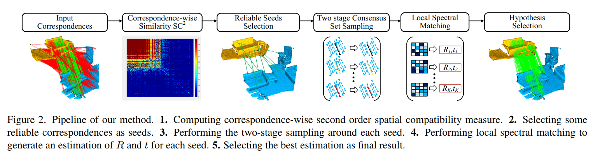

# SC^2-PCR: A Second Order Spatial Compatibility for Efficient and Robust Point Cloud Registration

PyTorch implementation of the paper:

[SC^2-PCR: A Second Order Spatial Compatibility for Efficient and Robust Point Cloud Registration](https://arxiv.org/abs/2203.14453).

Zhi Chen, [Kun Sun](https://scholar.google.com/citations?user=Ay6kCm4AAAAJ&hl=en), Fan Yang, [Wenbing Tao](https://scholar.google.co.uk/citations?user=jRDPE2AAAAAJ&hl=zh-CN&oi=ao).

## Introduction

In this paper, we present a second order spatial compatibility (SC^2) measure based method for efficient and robust point cloud registration (PCR), called SC^2-PCR. Firstly, we propose a second order spatial compatibility (SC^2) measure to compute the similarity between correspondences. It considers the global compatibility instead of local consistency, allowing for more distinctive clustering between inliers and outliers at early stage. Based on this measure, our registration pipeline employs a global spectral technique to find some reliable seeds from the initial correspondences. Then we design a two-stage strategy to expand each seed to a consensus set based on the SC^2 measure matrix. Finally, we feed each consensus set to a weighted SVD algorithm to generate a candidate rigid transformation and select the best model as the final result. Our method can guarantee to find a certain number of outlier-free consensus sets using fewer samplings, making the model estimation more efficient and robust. In addition, the proposed SC^2 measure is general and can be easily plugged into deep learning based frameworks. Extensive experiments are carried out to investigate the performance of our method.



## Requirements

If you are using conda, you may configure PointDSC as:

    conda env create -f environment.yml
    conda activate SC2_PCR
    
## 3DMatch

### Data preparation

Downsample and extract FPFH and FCGF descriptors for each frame of the 3DMatch test dataset. [PointDSC](https://github.com/XuyangBai/PointDSC) provides the pre-computed descriptors for the 3DMatch test set [here](https://drive.google.com/file/d/1zuf6NSD3-dHtTpk34iHtxAf8DQx3Y7RH/view?usp=sharing). Then download the ground truth poses from the [website of 3DMatch Benchmark](http://3dmatch.cs.princeton.edu/#geometric-registration-benchmark). The data should be organized as follows:

```
--data--3DMatch                
        ├── fragments                 
        │   ├── 7-scene-redkitechen/
        |   |   ├── cloud_bin_0.ply
        |   |   ├── cloud_bin_0_fcgf.npz
        |   |   ├── cloud_bin_0_fpfh.npz
        │   |   └── ...      
        │   ├── sun3d-home_at-home_at_scan1_2013_jan_1/      
        │   └── ...                
        ├── gt_result                   
        │   ├── 7-scene-redkitechen-evaluation/   
        |   |   ├── 3dmatch.log
        |   |   ├── gt.info
        |   |   ├── gt.log
        │   |   └── ...
        │   ├── sun3d-home_at-home_at_scan1_2013_jan_1-evaluation/
        │   └── ...                               
```

### Testing

Use the following command for testing.

```bash
python ./test_3DMatch.py --config_path config_json/config_3DMatch.json
```

The CUDA_DEVICE and basic parameters can be changed in the json file.

## 3DLoMatch

### Data preparation

FPFH and FCGF descriptors can be prepared in the same way as testing 3DMatch. If you want to test the [predator](https://github.com/prs-eth/OverlapPredator) descriptor, you should first follow the offical instruction of predator to extract the descriptors for 3DMatch dataset and organize the data as follows: 

```
--data--3DLoMatch                
        ├── 0.pth        
        ├── 1.pth                 
        ├── ...  
        └── 1780.pth
```
